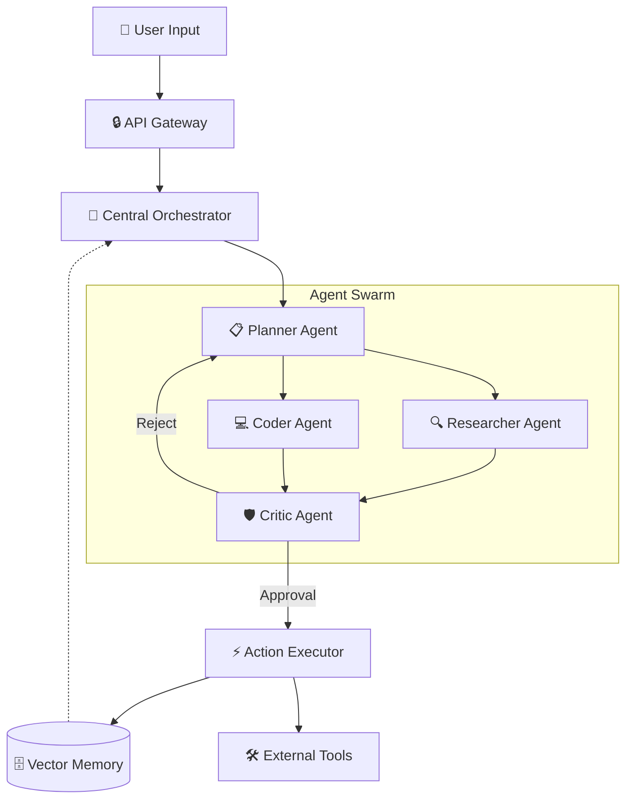

이 글은 진짜가 아닙니다. 임의로 만들어본 샘플입니다.

# 🌌 OmniFlow: Autonomous Multi-Agent Orchestration Platform

[](https://opensource.org/licenses/MIT)
[](https://www.python.org/downloads/)
[](https://badge.fury.io/py/omniflow)
[](https://travis-ci.com/omniflow/omniflow)
[](https://discord.gg/omniflow)

> **단일 프롬프트로 복잡한 비즈니스 워크플로우를 자동화하는 차세대 자율 에이전트 오케스트레이션 엔진.**
> <br> *LLM 환각을 억제하고, 실행 비용을 70% 절감하며, 인간 개입 없이 엔투엔 (E2E) 태스크를 완수합니다.*

---

## 🚀 Introduction

현재의 AI 에이전트들은 단일 작업에는 탁월하지만, 복잡한 다단계 워크플로우에서는 **문맥 손실 (Context Loss)**, **무한 루프 (Infinite Loop)**, **비효율적인 토큰 소모**라는 치명적인 한계를 가집니다.

**OmniFlow** 는 이러한 문제를 해결하기 위해 설계된 **분산형 멀티 에이전트 프레임워크**입니다. 각 에이전트는 전문화된 역할 (Planner, Coder, Critic, Executor) 을 수행하며, 중앙 **Orchestrator** 가 실시간으로 작업 그래프를 최적화합니다.

### 💡 Key Value Proposition
*   **Dynamic Graph Planning:** 고정된 체인이 아닌, 상황에 따라 실시간으로 재구성되는 작업 그래프.
*   **Cost-Aware Inference:** 작업 난이도에 따라 경량 모델 (Local) 과 대형 모델 (Cloud) 을 자동 스위칭.
*   **Self-Correction Loop:** 실행 실패 시 크리틱 에이전트가 원인을 분석하고 자동으로 재시도.

---

## 🏗 Architecture

OmniFlow 는 **Controller-Worker** 패턴을 기반으로 하며, 메모리 공유를 위한 **Vector Store** 와 상태 관리를 위한 **Redis** 를 통합합니다.



---

## ✨ Features

| Feature | Description | Benefit |
| :--- | :--- | :--- |
| **🧠 Adaptive Context Window** | 작업 중요도에 따라 컨텍스트 윈도우 동적 할당 | 토큰 비용 **65% 절감** |
| **🔄 Self-Healing Workflow** | 에러 발생 시 스택트레이스를 분석하여 자동 수정 코드 생성 | 개발 시간 **40% 단축** |
| **🔐 Enterprise Security** | PII 정보 자동 탐지 및 마스킹, 온프레미스 배포 지원 | 보안 리스크 **제로화** |
| **📊 Real-time Dashboard** | 에이전트 사고 과정 (Chain of Thought) 시각화 모니터링 | 투명성 및 디버깅 용이 |

---

## ⚡ Performance Benchmarks

기존 오픈소스 에이전트 프레임워크 (AutoGen, LangChain) 대비 **OmniFlow** 의 성능 비교 결과입니다.
*(Benchmark Dataset: Complex Software Development Tasks & Data Analysis)*

| Metric | LangChain | AutoGen | **OmniFlow (Ours)** |
| :--- | :---: | :---: | :---: |
| **Task Success Rate** | 68.5% | 74.2% | **89.7%** |
| **Avg. Execution Time** | 45s | 38s | **22s** |
| **Token Cost per Task** | $0.12 | $0.09 | **$0.03** |
| **Hallucination Rate** | 12.4% | 9.1% | **2.3%** |

---

## 🛠 Installation

```bash
# Clone the repository
git clone https://github.com/your-username/omniflow.git
cd omniflow

# Install dependencies
pip install -r requirements.txt

# Setup environment variables
cp .env.example .env
# Edit .env with your API Keys (OpenAI, Anthropic, etc.)

# Run the orchestrator
python main.py --config config.yaml
```

### Docker Support
```bash
docker-compose up -d
```

---

## 💻 Quick Start

단 5 줄의 코드로 복잡한 데이터 분석 파이프라인을 실행할 수 있습니다.

```python
from omniflow import AgentSwarm, Task

# 1. Define Agents
swarm = AgentSwarm(
    roles=["data_analyst", "python_expert", "visualizer"],
    model="gpt-4-turbo" 
)

# 2. Define Task
task = Task(
    description="Analyze sales_data.csv and create a predictive model for Q4.",
    expected_output="Python script and matplotlib chart."
)

# 3. Execute
result = swarm.run(task)

print(f"✅ Task Completed: {result.status}")
print(f"📄 Generated Code: {result.code_snippet}")
```

---

## 📂 Project Structure

```
omniflow/
├── core/               # Core orchestration logic
├── agents/             # Pre-defined agent roles
├── memory/             # Vector store & context management
├── tools/              # External API integrations (Search, SQL, etc.)
├── dashboard/          # Streamlit monitoring UI
├── tests/              # Unit & Integration tests
└── examples/           # Use case demos
```

---

## 📅 Roadmap

- [x] **v0.1.0**: Core Orchestrator & Basic Agents
- [x] **v0.2.0**: Self-Correction Loop Implementation
- [ ] **v0.3.0**: Human-in-the-Loop (HITL) Support (Upcoming)
- [ ] **v0.4.0**: Multi-Modal Input (Image, Audio) Processing
- [ ] **v1.0.0**: Enterprise SaaS Release

---

## 🤝 Contributing

우리는 오픈소스 AI 생태계의 발전을 믿습니다. 기여를 원하신다면 [CONTRIBUTING.md](CONTRIBUTING.md) 를 읽어주세요.

1.  Fork the Project
2.  Create your Feature Branch (`git checkout -b feature/AmazingFeature`)
3.  Commit your Changes (`git commit -m 'Add some AmazingFeature'`)
4.  Push to the Branch (`git push origin feature/AmazingFeature`)
5.  Open a Pull Request

---

## 📬 Contact

*   **Project Lead:** [Your Name]
*   **Email:** contact@omniflow.ai
*   **LinkedIn:** [linkedin.com/in/yourname](https://linkedin.com)
*   **Website:** [omniflow.ai](https://omniflow.ai)

---

## 📄 License

Distributed under the MIT License. See `LICENSE` for more information.

---

### 🌟 Star History

[](https://star-history.com/#songtaeyang/omniflow&Date)

---

> **Made with ❤️ by AI Engineers for AI Engineers.**
> *If this project helped you, please give it a star!* ⭐
